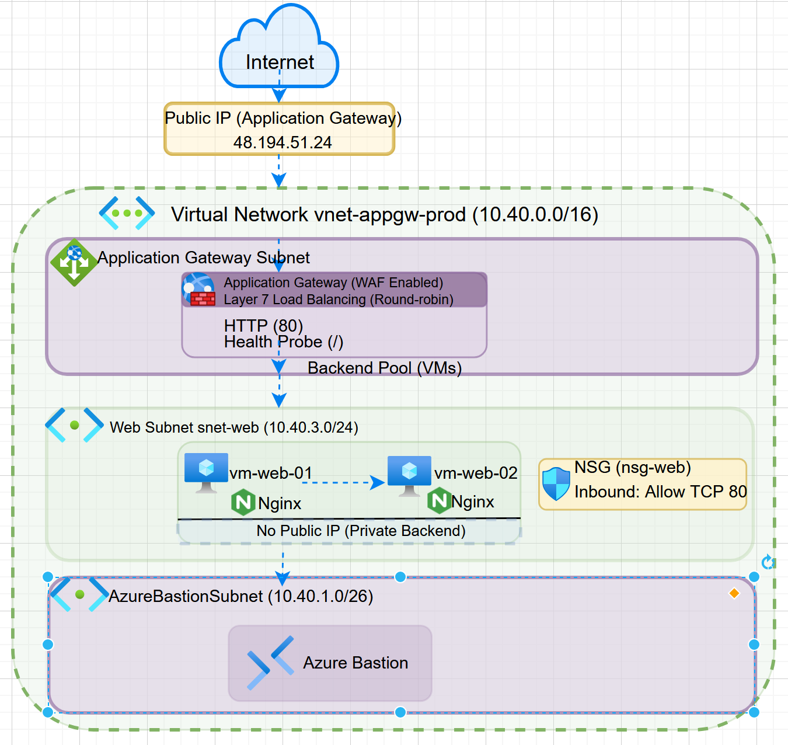

# Azure Secure Web Application with Application Gateway and WAF

## Overview
This project demonstrates a more production-style Azure web architecture focused on secure application delivery, private backend design, and controlled administrative access.

The lab includes Azure Application Gateway, Web Application Firewall (WAF), Azure Bastion, and two backend web servers hosted in a private subnet.

---

## Architecture

---

## What I Built
- Azure Virtual Network with three subnets
- Azure Bastion for secure VM access
- Two Ubuntu virtual machines in a private web subnet
- Azure Application Gateway for web traffic routing
- WAF-enabled frontend protection
- NSG to control access to the web subnet
- NGINX installed on both backend web servers

---

## Network Design
- `AzureBastionSubnet` for Bastion
- `snet-appgw` for Application Gateway
- `snet-web` for backend web servers
- Backend VMs do not use public IP addresses

---

## How It Works
- Users access the web application through Application Gateway
- Application Gateway routes traffic to healthy backend VMs
- Azure Bastion is used for private admin access to the VMs
- WAF helps protect the web application entry point

---

## Key Concepts Demonstrated
- Secure web application publishing
- Layer 7 load balancing
- Backend health monitoring
- Private subnet design
- Bastion-based administration
- Web Application Firewall (WAF)

---

## Security Design
- Backend VMs are private and have no public IPs
- Bastion is used for management access instead of exposing RDP/SSH publicly
- Web traffic enters through Application Gateway
- NSG controls access within the virtual network
- WAF is enabled to strengthen frontend protection

---

## Screenshots
(Screenshots are available in the /screenshots folder)

---

## Lessons Learned
- Application Gateway provides more advanced web traffic control than a basic load balancer
- Bastion improves security by removing the need for public VM access
- Subnet planning matters when designing Azure architectures
- Backend health and routing configuration are critical for successful application delivery
